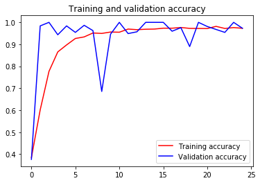

# Multi-class classification using CNN
This is a model designed to detect hand gestures using a Deep Convolutional Neural Network. This is a part of the CNN course provided by Mr. Laurence Moroney in Coursera.

## Step 1 - Extracting the data
First of all, we must extract the data from their folders.


```python
import os

rock_dir = os.path.join('rps/rock')
paper_dir= os.path.join('rps/paper')
scissor_dir = os.path.join('rps/scissors')

print(f'Total Rock Images: {len(os.listdir(rock_dir))}')
print(f'Total Paper Images: {len(os.listdir(paper_dir))}')
print(f'Total Scissor Images: {len(os.listdir(scissor_dir))}')

print('Getting some image names . . .')

rock_files = os.listdir(rock_dir)
paper_files= os.listdir(paper_dir)
scissor_files= os.listdir(scissor_dir)

print(os.listdir(rock_dir)[:10])
print(os.listdir(paper_dir)[:10])
print(os.listdir(scissor_dir)[:10])
```

    Total Rock Images: 840
    Total Paper Images: 840
    Total Scissor Images: 840
    Getting some image names . . .
    ['rock04-119.png', 'rock02-070.png', 'rock02-114.png', 'rock07-k03-111.png', 'rock05ck01-039.png', 'rock01-012.png', 'rock07-k03-103.png', 'rock06ck02-061.png', 'rock04-001.png', 'rock03-119.png']
    ['paper03-022.png', 'paper04-037.png', 'paper03-114.png', 'paper04-071.png', 'paper03-106.png', 'paper06-071.png', 'paper06-097.png', 'paper05-024.png', 'paper02-041.png', 'paper02-086.png']
    ['testscissors03-039.png', 'testscissors03-062.png', 'scissors04-011.png', 'scissors01-015.png', 'testscissors02-061.png', 'scissors03-096.png', 'testscissors01-059.png', 'scissors01-033.png', 'scissors04-088.png', 'scissors02-020.png']


## Step 2 - Displaying some train images


```python
%matplotlib inline

import matplotlib.pyplot as plt
import matplotlib.image as mpimg

pic_index = 2

next_rock = [os.path.join(rock_dir, fname) 
                for fname in rock_files[pic_index-2:pic_index]]
next_paper = [os.path.join(paper_dir, fname) 
                for fname in paper_files[pic_index-2:pic_index]]
next_scissors = [os.path.join(scissor_dir, fname) 
                for fname in scissor_files[pic_index-2:pic_index]]

for i, img_path in enumerate(next_rock+next_paper+next_scissors):
  #print(img_path)
  img = mpimg.imread(img_path)
  plt.imshow(img)
  plt.axis('Off')
  plt.show()
```


## Step 3 - Getting things prepared for the model


```python
import tensorflow as tf
import keras_preprocessing
from keras_preprocessing import image
from keras_preprocessing.image import ImageDataGenerator

TRAINING_DIR = os.path.join('rps/')
training_datagen = ImageDataGenerator(
      rescale = 1./255,
	  rotation_range=40,
      width_shift_range=0.2,
      height_shift_range=0.2,
      shear_range=0.2,
      zoom_range=0.2,
      horizontal_flip=True,
      fill_mode='nearest')

VALIDATION_DIR =os.path.join('rps_valid/')
validation_datagen = ImageDataGenerator(rescale = 1./255)

train_generator = training_datagen.flow_from_directory(
	TRAINING_DIR,
	target_size=(150,150),
	class_mode='categorical'
)

validation_generator = validation_datagen.flow_from_directory(
	VALIDATION_DIR,
	target_size=(150,150),
	class_mode='categorical'
)
```

    Found 2520 images belonging to 3 classes.
    Found 372 images belonging to 3 classes.


## Step 4 -  Declaring, compiling and summarizing the model


```python
model = tf.keras.models.Sequential([
    # Note the input shape is the desired size of the image 150x150 with 3 bytes color
    
    # This is the first convolution
    tf.keras.layers.Conv2D(64, (3,3), activation='relu', input_shape=(150, 150, 3)),
    tf.keras.layers.MaxPooling2D(2, 2),
    
    # The second convolution
    tf.keras.layers.Conv2D(64, (3,3), activation='relu'),
    tf.keras.layers.MaxPooling2D(2,2),
    
    # The third convolution
    tf.keras.layers.Conv2D(128, (3,3), activation='relu'),
    tf.keras.layers.MaxPooling2D(2,2),
    
    # The fourth convolution
    tf.keras.layers.Conv2D(128, (3,3), activation='relu'),
    tf.keras.layers.MaxPooling2D(2,2),
    
    # Flatten the results to feed into a DNN
    tf.keras.layers.Flatten(),
    tf.keras.layers.Dropout(0.5),
    
    # 512 neuron hidden layer
    tf.keras.layers.Dense(512, activation='relu'),
    tf.keras.layers.Dense(3, activation='softmax')
])

model.summary()

model.compile(loss = 'categorical_crossentropy', optimizer='rmsprop', metrics=['accuracy'])
```

    Model: "sequential_1"
    _________________________________________________________________
    Layer (type)                 Output Shape              Param #   
    =================================================================
    conv2d_4 (Conv2D)            (None, 148, 148, 64)      1792      
    _________________________________________________________________
    max_pooling2d_4 (MaxPooling2 (None, 74, 74, 64)        0         
    _________________________________________________________________
    conv2d_5 (Conv2D)            (None, 72, 72, 64)        36928     
    _________________________________________________________________
    max_pooling2d_5 (MaxPooling2 (None, 36, 36, 64)        0         
    _________________________________________________________________
    conv2d_6 (Conv2D)            (None, 34, 34, 128)       73856     
    _________________________________________________________________
    max_pooling2d_6 (MaxPooling2 (None, 17, 17, 128)       0         
    _________________________________________________________________
    conv2d_7 (Conv2D)            (None, 15, 15, 128)       147584    
    _________________________________________________________________
    max_pooling2d_7 (MaxPooling2 (None, 7, 7, 128)         0         
    _________________________________________________________________
    flatten_1 (Flatten)          (None, 6272)              0         
    _________________________________________________________________
    dropout_1 (Dropout)          (None, 6272)              0         
    _________________________________________________________________
    dense_2 (Dense)              (None, 512)               3211776   
    _________________________________________________________________
    dense_3 (Dense)              (None, 3)                 1539      
    =================================================================
    Total params: 3,473,475
    Trainable params: 3,473,475
    Non-trainable params: 0
    _________________________________________________________________


## Step 5 - Training the model using the data


```python
history = model.fit_generator(train_generator, epochs=25, validation_data = validation_generator, verbose = 1)

model.save("rps.h5")
```

    Epoch 1/25
    79/79 [==============================] - 72s 918ms/step - loss: 1.1629 - accuracy: 0.3841 - val_loss: 0.9824 - val_accuracy: 0.3763
    Epoch 2/25
    79/79 [==============================] - 63s 792ms/step - loss: 0.8451 - accuracy: 0.6016 - val_loss: 0.4683 - val_accuracy: 0.9839
    Epoch 3/25
    79/79 [==============================] - 63s 793ms/step - loss: 0.5345 - accuracy: 0.7770 - val_loss: 0.1618 - val_accuracy: 1.0000
    Epoch 4/25
    79/79 [==============================] - 62s 788ms/step - loss: 0.3583 - accuracy: 0.8655 - val_loss: 0.1360 - val_accuracy: 0.9435
    Epoch 5/25
    79/79 [==============================] - 61s 767ms/step - loss: 0.2645 - accuracy: 0.8972 - val_loss: 0.0702 - val_accuracy: 0.9839
    Epoch 6/25
    79/79 [==============================] - 62s 788ms/step - loss: 0.2138 - accuracy: 0.9266 - val_loss: 0.1228 - val_accuracy: 0.9543
    Epoch 7/25
    79/79 [==============================] - 63s 792ms/step - loss: 0.1942 - accuracy: 0.9337 - val_loss: 0.0285 - val_accuracy: 0.9866
    Epoch 8/25
    79/79 [==============================] - 64s 810ms/step - loss: 0.1514 - accuracy: 0.9516 - val_loss: 0.1000 - val_accuracy: 0.9624
    Epoch 9/25
    79/79 [==============================] - 64s 810ms/step - loss: 0.1551 - accuracy: 0.9496 - val_loss: 0.6715 - val_accuracy: 0.6855
    Epoch 10/25
    79/79 [==============================] - 62s 782ms/step - loss: 0.1362 - accuracy: 0.9560 - val_loss: 0.1069 - val_accuracy: 0.9462
    Epoch 11/25
    79/79 [==============================] - 61s 768ms/step - loss: 0.1308 - accuracy: 0.9552 - val_loss: 0.0409 - val_accuracy: 1.0000
    Epoch 12/25
    79/79 [==============================] - 60s 763ms/step - loss: 0.0984 - accuracy: 0.9694 - val_loss: 0.1156 - val_accuracy: 0.9489
    Epoch 13/25
    79/79 [==============================] - 61s 766ms/step - loss: 0.1033 - accuracy: 0.9667 - val_loss: 0.0683 - val_accuracy: 0.9570
    Epoch 14/25
    79/79 [==============================] - 62s 789ms/step - loss: 0.1205 - accuracy: 0.9687 - val_loss: 0.0053 - val_accuracy: 1.0000
    Epoch 15/25
    79/79 [==============================] - 63s 794ms/step - loss: 0.1111 - accuracy: 0.9694 - val_loss: 0.0075 - val_accuracy: 1.0000
    Epoch 16/25
    79/79 [==============================] - 61s 768ms/step - loss: 0.0918 - accuracy: 0.9734 - val_loss: 0.0085 - val_accuracy: 1.0000
    Epoch 17/25
    79/79 [==============================] - 62s 780ms/step - loss: 0.0900 - accuracy: 0.9734 - val_loss: 0.0576 - val_accuracy: 0.9597
    Epoch 18/25
    79/79 [==============================] - 61s 778ms/step - loss: 0.0741 - accuracy: 0.9766 - val_loss: 0.0433 - val_accuracy: 0.9758
    Epoch 19/25
    79/79 [==============================] - 61s 767ms/step - loss: 0.0878 - accuracy: 0.9726 - val_loss: 0.2942 - val_accuracy: 0.8898
    Epoch 20/25
    79/79 [==============================] - 60s 762ms/step - loss: 0.0943 - accuracy: 0.9722 - val_loss: 0.0032 - val_accuracy: 1.0000
    Epoch 21/25
    79/79 [==============================] - 62s 787ms/step - loss: 0.0808 - accuracy: 0.9718 - val_loss: 0.0292 - val_accuracy: 0.9812
    Epoch 22/25
    79/79 [==============================] - 61s 769ms/step - loss: 0.0675 - accuracy: 0.9817 - val_loss: 0.0635 - val_accuracy: 0.9677
    Epoch 23/25
    79/79 [==============================] - 63s 794ms/step - loss: 0.0905 - accuracy: 0.9722 - val_loss: 0.0863 - val_accuracy: 0.9543
    Epoch 24/25
    79/79 [==============================] - 64s 814ms/step - loss: 0.0762 - accuracy: 0.9762 - val_loss: 0.0033 - val_accuracy: 1.0000
    Epoch 25/25
    79/79 [==============================] - 64s 806ms/step - loss: 0.1025 - accuracy: 0.9730 - val_loss: 0.0635 - val_accuracy: 0.9731


## Step 6- Visualizing accuracy & loss


```python
import matplotlib.pyplot as plt
acc = history.history['accuracy']
val_acc = history.history['val_accuracy']
loss = history.history['loss']
val_loss = history.history['val_loss']

epochs = range(len(acc))

plt.plot(epochs, acc, 'r', label='Training accuracy')
plt.plot(epochs, val_acc, 'b', label='Validation accuracy')
plt.title('Training and validation accuracy')
plt.legend(loc=0)
plt.figure()


plt.show()
```





    <Figure size 432x288 with 0 Axes>


```python
import numpy as np

test_dir = os.path.join('testset/')
print(os.listdir(test_dir))

for fname in os.listdir(test_dir):
    path = os.path.join('testset/'+fname)
    print(path)
    img = image.load_img(path, target_size=(150, 150))
    x = image.img_to_array(img)
    x = np.expand_dims(x, axis=0)
    
    images = np.vstack([x])
    classes = model.predict(images, batch_size=10)
    print('Filename: '+fname)
    print('Prediction Matrix',)
    print(classes)
    
    predicted_class_indices=np.argmax(classes,axis=1)

#print(predicted_class_indices)


    labels = (train_generator.class_indices)
    labels = dict((v,k) for k, v in labels.items())
    predictions = [labels[k] for k in predicted_class_indices]
    for p in predictions:
        print('Prediction: '+p)
```

    ['testrock01-01.png', 'paper01-059.png']
    testset/testrock01-01.png
    Filename: testrock01-01.png
    Prediction Matrix
    [[0. 1. 0.]]
    Prediction: rock
    testset/paper01-059.png
    Filename: paper01-059.png
    Prediction Matrix
    [[1. 0. 0.]]
    Prediction: paper


```python

```
